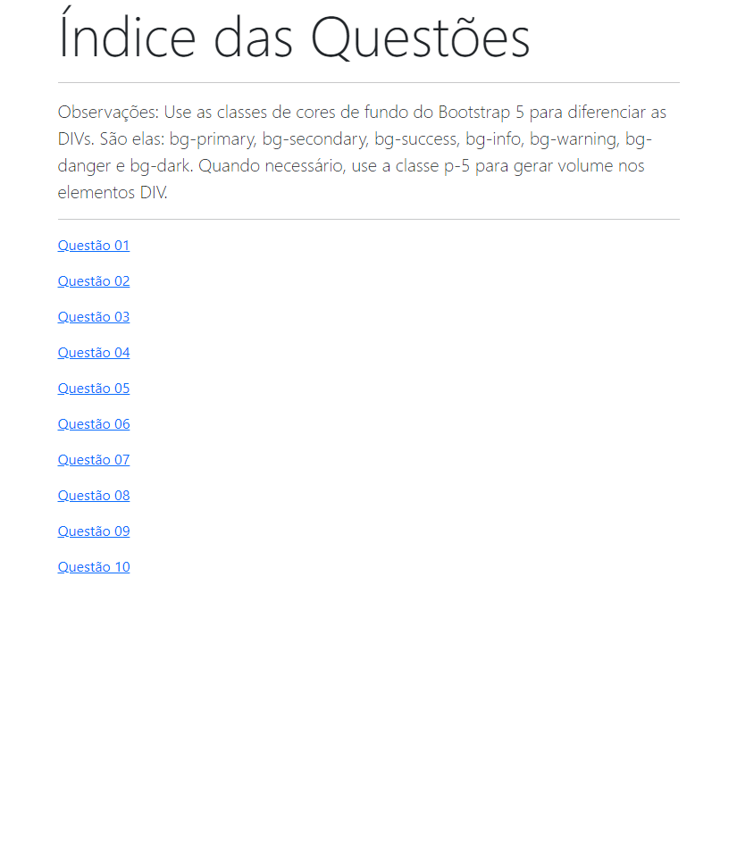

## Instituto Federal do Espírito Santo

# Bootstrap-5 Atividade Pratica da Semana-2  

https://mjpfelicia.github.io/Bootstrap-5-atividade-pratica-da-semana-2/

                 Welcome! 👋

## Índice

- Desafio
- Links
- Tecnologias usadas
- O que eu aprendi
- Recursos úteis
- Desafio
- layout ideal para a seção, dependendo do tamanho da tela

## Links usados:

- https://developer.mozilla.org/en-US/docs/Learn/CSS
- https://youtu.be/E_bAIA1LJj0?si=-FYZEFaObuQfZdVS
- https://getbootstrap.com.br/docs/4.1/layout/grid/

## Tecnologias usadas:
- Marcação HTML5 semântica
- Bootstrap,framework

## O que eu aprendi

- Melhorando as habilidades no Bootstrap
- Marcadores semânticos importantes - - para HTML
- Praticando para melhorar o - - design da página

## Autor
- @mjpfelicia
